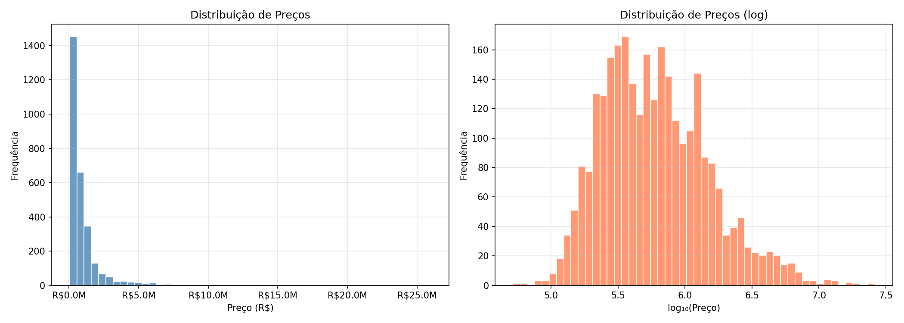
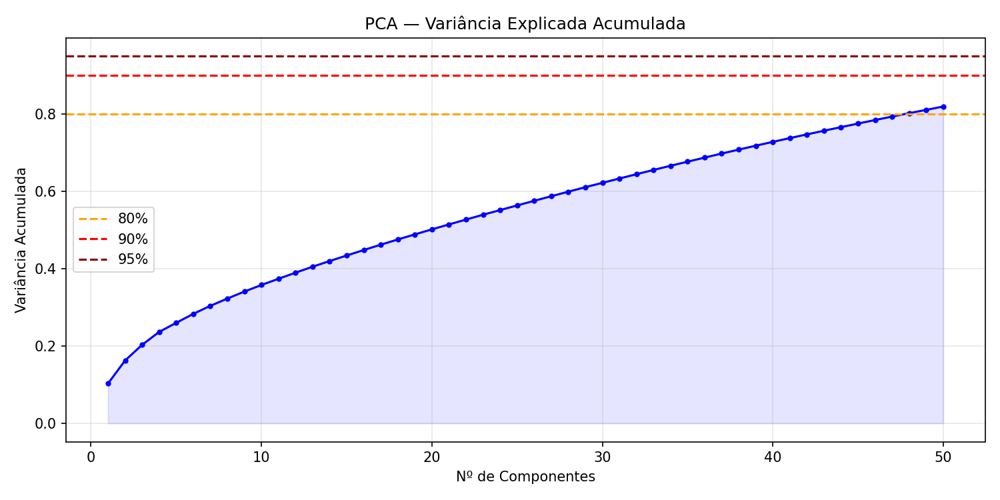
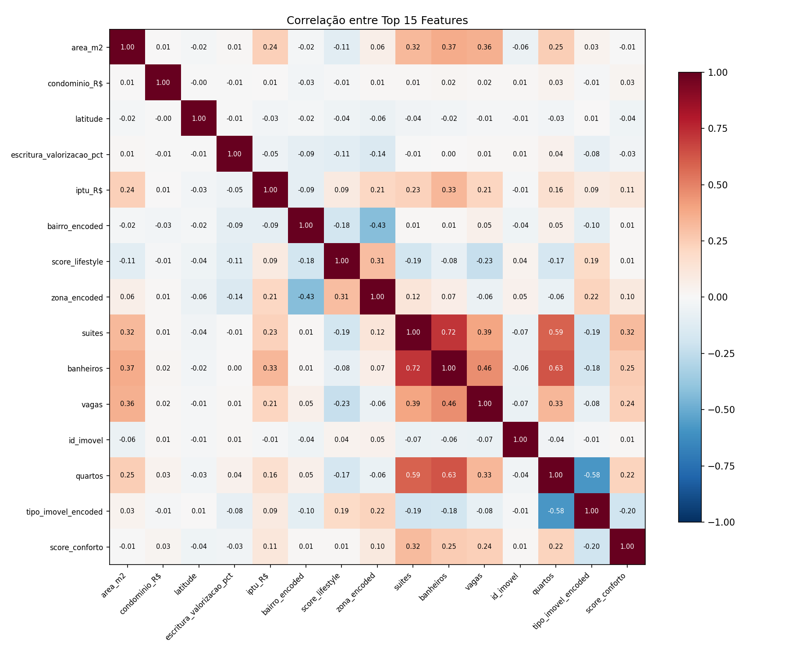
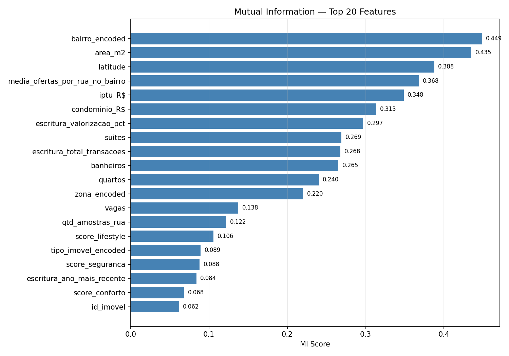
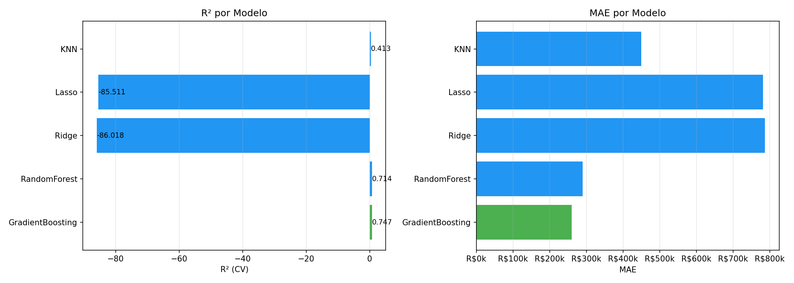
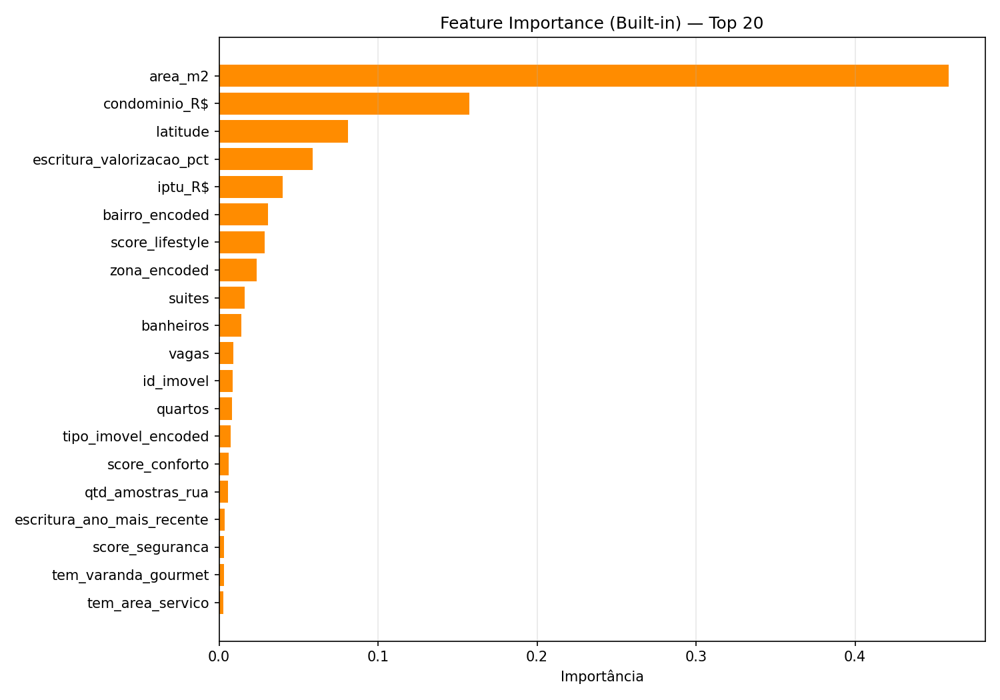

# 🧪 Análise de Features e Seleção de Modelo

**Data:** 19/04/2026 07:22  
**Dataset:** 2842 amostras, 103 features candidatas  
**Target:** `valor_R$`

## 📊 PCA (Análise de Componentes Principais)

- 80% da variância com **48** componentes (de 103)
- 90% da variância com **61** componentes
- 95% da variância com **70** componentes

**Top loadings PC1:**

- `final_tem_lazer`: 0.2662
- `score_conforto`: 0.2645
- `tem_piscina`: 0.2569
- `tem_churrasqueira`: 0.2433
- `tem_salao_festas`: 0.2267
- `final_tem_varanda`: 0.2245
- `tem_playground`: 0.2195
- `tem_academia`: 0.2151
- `tem_sauna`: 0.2133
- `tem_quadra_poliesportiva`: 0.2064

## 🔗 Correlação

- Pares com correlação > 0.95: **77**
- Features removidas por colinearidade: **16**

| Feature A | Feature B | Correlação |
|-----------|-----------|:----------:|
| `latitude` | `longitude` | 0.993 |
| `latitude` | `dist_praia_km` | 0.986 |
| `longitude` | `dist_praia_km` | 0.96 |
| `latitude` | `dist_lazer_km` | 0.986 |
| `longitude` | `dist_lazer_km` | 0.973 |
| `dist_praia_km` | `dist_lazer_km` | 0.981 |
| `latitude` | `dist_shopping_km` | 0.971 |
| `dist_praia_km` | `dist_shopping_km` | 0.979 |
| `dist_lazer_km` | `dist_shopping_km` | 0.993 |
| `latitude` | `dist_cultura_km` | 0.976 |
| `longitude` | `dist_cultura_km` | 0.958 |
| `dist_praia_km` | `dist_cultura_km` | 0.978 |
| `dist_lazer_km` | `dist_cultura_km` | 0.996 |
| `dist_shopping_km` | `dist_cultura_km` | 0.997 |
| `latitude` | `dist_mercado_km` | 0.985 |

## 🧠 Mutual Information

| Rank | Feature | MI Score |
|:----:|---------|:--------:|
| 1 | `bairro_encoded` | 0.4486 ████████ |
| 2 | `area_m2` | 0.4348 ████████ |
| 3 | `latitude` | 0.3875 ███████ |
| 4 | `media_ofertas_por_rua_no_bairro` | 0.3680 ███████ |
| 5 | `iptu_R$` | 0.3485 ██████ |
| 6 | `condominio_R$` | 0.3134 ██████ |
| 7 | `escritura_valorizacao_pct` | 0.2967 █████ |
| 8 | `suites` | 0.2690 █████ |
| 9 | `escritura_total_transacoes` | 0.2677 █████ |
| 10 | `banheiros` | 0.2652 █████ |
| 11 | `quartos` | 0.2403 ████ |
| 12 | `zona_encoded` | 0.2203 ████ |
| 13 | `vagas` | 0.1376 ██ |
| 14 | `qtd_amostras_rua` | 0.1218 ██ |
| 15 | `score_lifestyle` | 0.1058 ██ |
| 16 | `tipo_imovel_encoded` | 0.0893 █ |
| 17 | `score_seguranca` | 0.0881 █ |
| 18 | `escritura_ano_mais_recente` | 0.0840 █ |
| 19 | `score_conforto` | 0.0683 █ |
| 20 | `id_imovel` | 0.0619 █ |

Features irrelevantes (MI=0): **10**

## 🏆 Comparação de Modelos

| Modelo | R² (CV) | ± Std | MAE |
|--------|:-------:|:-----:|----:|
| **GradientBoosting** 👑 | +0.7469 | 0.0227 | R$     259,920 |
| **RandomForest** | +0.7135 | 0.0273 | R$     290,155 |
| **Ridge** | -86.0179 | 169.2325 | R$     786,664 |
| **Lasso** | -85.5106 | 168.4013 | R$     781,338 |
| **KNN** | +0.4134 | 0.0690 | R$     449,772 |

**Melhor modelo:** GradientBoosting

## ⚙️ Hiperparâmetros Otimizados

**R² após tuning:** 0.7742

| Parâmetro | Valor |
|-----------|-------|
| `learning_rate` | `0.05` |
| `max_depth` | `5` |
| `min_samples_leaf` | `2` |
| `n_estimators` | `300` |
| `subsample` | `0.8` |

## 📈 Feature Importance Final

**Features recomendadas:** 83/103

### Built-in Importance

| Rank | Feature | Importância |
|:----:|---------|:-----------:|
| 1 | `area_m2` | 0.459 ██████████████████████ |
| 2 | `condominio_R$` | 0.158 ███████ |
| 3 | `latitude` | 0.081 ████ |
| 4 | `escritura_valorizacao_pct` | 0.059 ██ |
| 5 | `iptu_R$` | 0.040 ██ |
| 6 | `bairro_encoded` | 0.031 █ |
| 7 | `score_lifestyle` | 0.029 █ |
| 8 | `zona_encoded` | 0.024 █ |
| 9 | `suites` | 0.016  |
| 10 | `banheiros` | 0.014  |
| 11 | `vagas` | 0.009  |
| 12 | `id_imovel` | 0.009  |
| 13 | `quartos` | 0.008  |
| 14 | `tipo_imovel_encoded` | 0.007  |
| 15 | `score_conforto` | 0.006  |
| 16 | `qtd_amostras_rua` | 0.005  |
| 17 | `escritura_ano_mais_recente` | 0.004  |
| 18 | `score_seguranca` | 0.003  |
| 19 | `tem_varanda_gourmet` | 0.003  |
| 20 | `tem_area_servico` | 0.003  |

### Permutation Importance (mais robusto)

| Rank | Feature | Importância |
|:----:|---------|:-----------:|
| 1 | `area_m2` | 0.8111 |
| 2 | `condominio_R$` | 0.1053 |
| 3 | `latitude` | 0.1049 |
| 4 | `zona_encoded` | 0.0734 |
| 5 | `escritura_valorizacao_pct` | 0.0522 |
| 6 | `score_lifestyle` | 0.0346 |
| 7 | `suites` | 0.0224 |
| 8 | `bairro_encoded` | 0.0214 |
| 9 | `iptu_R$` | 0.0177 |
| 10 | `vagas` | 0.0099 |
| 11 | `banheiros` | 0.0055 |
| 12 | `score_conforto` | 0.0049 |
| 13 | `id_imovel` | 0.0047 |
| 14 | `tipo_imovel_encoded` | 0.0036 |
| 15 | `qtd_amostras_rua` | 0.0028 |
| 16 | `quartos` | 0.0025 |
| 17 | `score_qualidade_anuncio` | 0.0015 |
| 18 | `andar` | 0.0014 |
| 19 | `tag_vista_mar` | 0.0012 |
| 20 | `score_seguranca` | 0.0012 |

## ✅ Configuração Recomendada

- **Modelo:** GradientBoosting
- **Features:** 83 (de 103)
- **R² esperado:** 0.7742
- **Arquivo de config:** `ia/config_modelo.json`
- **Modelo salvo:** `ia/melhor_modelo.joblib`
